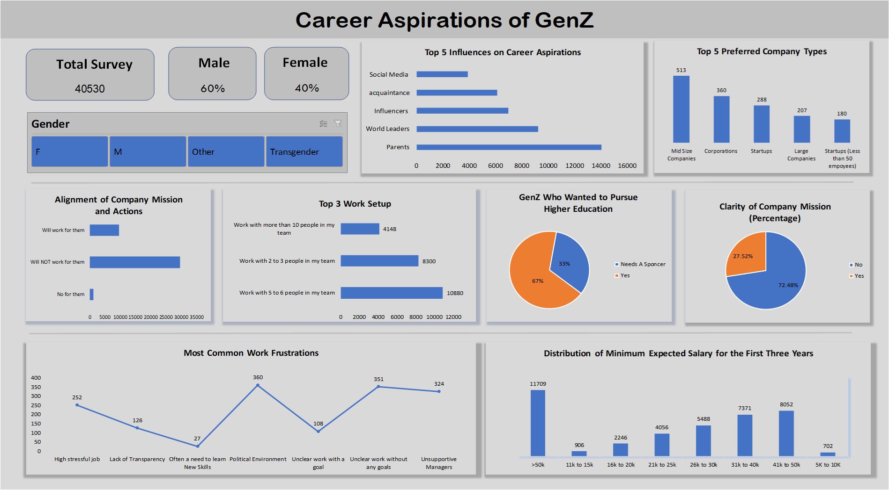

# Career Aspirations of GenZ Dashboard

## Overview
This Excel dashboard provides insights into the career aspirations of GenZ based on survey data. The dashboard is designed to answer key business questions related to the factors influencing career choices, preferences for company types, and expectations regarding work environments.

## Business Questions Addressed
1. **Top 5 Influences on Career Aspirations:**
   - Identifies the primary factors that shape the career goals of GenZ.

2. **Top 5 Preferred Company Types:**
   - Lists the most favored types of companies where GenZ aspires to work.

3. **GenZ Who Wanted to Pursue Higher Education:**
   - Analyzes the percentage of respondents planning to further their education.

4. **Top 3 Work Setups:**
   - Highlights the most preferred work arrangements (e.g., remote, hybrid, on-site).

5. **Alignment of Company Mission and Actions:**
   - Assesses how well respondents feel companies align their actions with their stated mission.

6. **Clarity of Company Mission (Percentage):**
   - Measures the percentage of respondents who understand their company’s mission clearly.

7. **Distribution of Minimum Expected Salary for the First Three Years:**
   - Visualizes the expected salary range of GenZ in their initial career years.

8. **Most Common Work Frustrations:**
   - Identifies the top frustrations experienced by GenZ in the workplace.

## Interactive Features
- **Slicer: Gender**
   - Allows filtering of the data by gender to see differences in responses.
   
- **KPIs:**
   - **Total Respondents:** Shows the total number of survey participants.
   - **Gender Distribution:** Displays the proportion of male and female respondents (e.g., 60% Male, 40% Female).

## How to Use
1. Open the Excel file containing the dashboard.
2. Use the gender slicer to filter the data and view insights based on gender.
3. Refer to the KPIs for quick insights into the respondent demographics.
4. Analyze each section of the dashboard to answer the business questions outlined above.

## Image Reference

